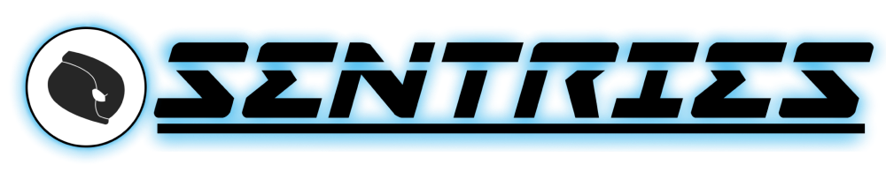

# INTRO

**There is an economic, technological, and cultural migration happening**: **Money, brainpower, and social status are moving from TradFi and Web2 to DeFi and Web3.**

From gamers, to bankers, to artists, every day more and more people are participating in Web3 economies. Those who lay down the infrastructure needed by these waves of mass adopters will be poised to create generational fortunes, similar to those who built railroads and oil refineries during the industrial revolution.

That's why _**Sentries**_ is a **Blockchain Infrastructure Company deploying** [**Solana validators and RPC nodes**](project-objectives/5.-b2b-services.md).

