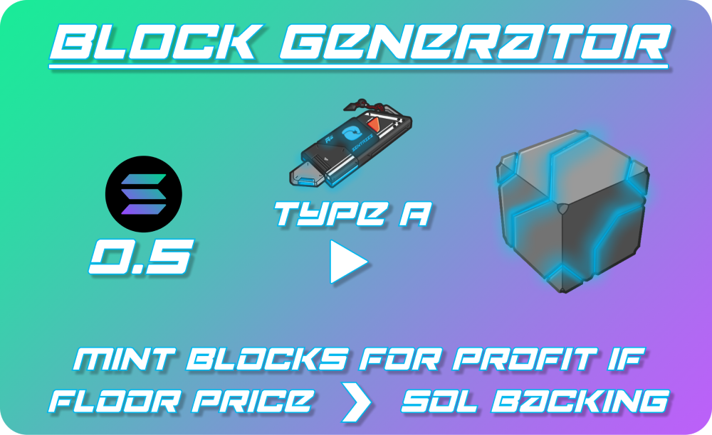

# 4. Advanced Lode Functions

## BLOCK GENERATOR

Holders of at least **1** [**Sentry PFP**](../sentries-pfps.md)**+**[**Lode Link \[Type A\]**](2.-lode-links.md#lode-link-utility) **pair** will be able to **mint additional Power Blocks** by paying the corresponding SOL backing into [**The Lode**](1.-the-lode.md).

As more utility is added to Power Blocks and circulating supply is reduced, their market price should increase above their SOL backing over time. This should provide recurring arbitrage opportunities to mint more Power Blocks.

## BLOCK FUSER

Holders of at least **1** [**Sentry PFP**](../sentries-pfps.md)**+**[**Lode Link \[Type B\]**](2.-lode-links.md#lode-link-utility) **pair** will be able to **Merge** [**Power Blocks**](3.-power-blocks.md) into higher SOL-value Power Blocks.

* 4x Blue Power Blocks = 1 Red Power Block
* 5x Red Power Blocks = 1 Solana Power Block
* 5x Solana Power Blocks = 1 Golden Power Block

**Golden Power Blocks** that may be used as **SOL loan collateral**.

## BLOCK FURNACE

Holders of at least **1** [**Sentry PFP**](../sentries-pfps.md)**+**[**Lode Link \[Type C\]** ](2.-lode-links.md#lode-link-utility)**pair** will be able to **Burn** **Power Blocks** for **95% of their SOL backing** out of The Lode. **5%**&#x20;

This will allow our holders to arbitrage Power Blocks for a profit if their market price falls substantially below their SOL backing.

## SUB-GRIDS

The Lode's **Sub-Grids** are configurable **single-sided staking pools**.

Sub-Grids allow anybody to **open and fund their own yield farms** in a permissionless fashion by **staking a** [**Lode Link**](2.-lode-links.md#lode-link-utility) with the **Sub-Grid Control trait.**

**Sub-Grid operators can configure** the tokens to be staked, the tokens to be rewarded, and the reward emission settings.

Premium Sub-Grid functions and Branded pools will be available for SOL fees.

