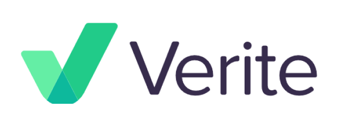

# 6. IDO

Once the bear market subsides, we will conduct an Initial DEX Offering of a novel fungible token.

The funds raised from this IDO will be used to:

1. deploy a Solana validator cluster;
2. establish a validator-based capital fund; and
3. develop a Web3 KYC and credit rating platform using Circle's Verite protocol.

More info to follow post-mint.

