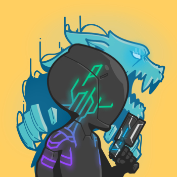
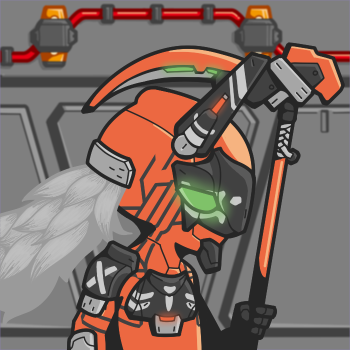

# SENTRIES PFPs

## What _Sentries_?

_8,000 Non-Fungible Sentries living on the Solana Blockchain, working in Sync to run the network and make money doing it!_

## Why _Sentries_?

When designed properly, **NFTs and mints can super-charge community building, raise startup capital, and align stakeholders towards value creation.** In addition, **Profile Picture (PFP) NFTs** enable both **individual and communal online identities** on social media.

Oh, and they're **FUN to collect.**

**Infrastructure investments don't have to be boring.**

## How _Sentries_?

1\. **Quality**: Crisp linework, vibrant yet balanced palettes, and bold cell-shading make each Sentry's features pop at a glance.

2\. **Recognizable**: Sentries' unique design and body shape give them a silhouette that is easily differentiated from other PFP collections.

3\. **Unique**: Each Sentry is different enough from the rest to give them their own unique personality. This makes them more relatable PFPs to their holders.

4\. **Clean**: Packing too much detail into a PFP can make the art feel busy and less memorable.

5\. **Numerous**: A 8K supply collection enables a large community, affordable mint pricing, and strong secondary market volumes.

6\. **Sub-DAO Friendly**: The Sentries collection includes rare, easily recognizable traits that can form the basis for community sub-DAOs, similar to Alien SMBs or Coral OKBs.

7\. **Charming**: They're cute and cool, a great combination for broad appeal.

## Who _**Sentries**_?

The Admin Team behind _**Sentries**_ will be privately doxxing with the Launchpad we lock in with.\
\
[Divide](https://twitter.com/\_div\_ide\_) CEO/COO, Biz Dev\
[0xNallok](https://twitter.com/0xTuti) - CTO, Infrastructure Relation\
[DaveR](https://twitter.com/Dave\_Kayac) - Creative Director, Legal Consultant\
[Bird](https://twitter.com/JjTheDeaMaxi) - Chief of Staff, Socials\
[Stuffalot](https://twitter.com/Stuffalot01) - Community Manager\
\
However, the management of the Sentries community will be shared with the [**SentryDAO**](sentry-dao.md)**.** Holding at least 1 Sentry is required for DAO membership.

## Wen _Sentries_?

:handshake: **MINT DATE: TBA AUG | MINT PRICE: 1 SOL | SUPPLY: 8,000 | POST-MINT OUT REVEAL** :handshake:

**ROYALTIES:** 7% (3.5% Admin Team / 3.5% The Lode Self-Stake)

**Follow us on** [**Twitter**](https://twitter.com/Sentries\_SOL) **and join our** [**Discord**](https://discord.com/invite/sentries) **for Whitelist Opportunities.**

